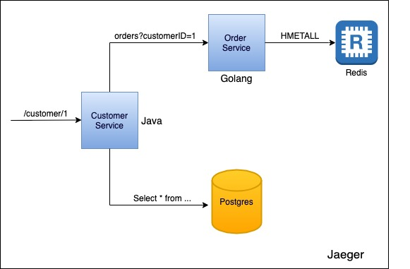

# Jaeger Microservices implementation

This project consists of two rudimentary micro-services having separate databases with one using Postgres and other Redis. The aim of this project is to setup, learn Jaeger, and Open Tracing standards in a micro-services environment.

> **Note:** This project is done only for experimental purposes and should only be used as a reference.

## Architecture 



## Pre-requisites

- Java, 1.8 is the tested version.
- Golang, 1.13 is the tested version.
- Docker (to run Jaeger)

## Environment setup instructions

Run Jaeger using docker to capture tracing data using:

```bash
docker run \
  --rm \
  --name jaeger \
  -p6831:6831/udp \
  -p16686:16686 \
  jaegertracing/all-in-one:latest
```

Start Postgres container used by customer service:

```bash
docker run --name postgres -e POSTGRES_USER=postgres -e POSTGRES_PASSWORD=admin -p 5432:5432 -d postgres
```

Start Redis container used by order service:

```bash
docker run --name redis -p 6379:6379 -d redis
```


## Running instructions

Run customer service using:


```bash
cd customerservice
./mvnw spring-boot:run
```


Run Order service using:


```bash
cd orderservice
go run main.go
```

## Test setup
Open browser or use a curl client to invoke /customer api:


```bash
curl localhost:8080/customer/1
```

> **Note:** Ignore the output of the curl command; It is not relevent to Jaeger and this project.

Navigate to Jaeger from browser: http://localhost:16686/


> You should see 4 services in Jaeger including Customer, Order, postgres, and redis. Search traces of Customer service and it should have 5 spans created, and trace data of all four services invoked with the request.

Order service is running on port 8081; You can curl it using:

```bash
curl http://localhost:8081/orders?customerID=2
```

## Compare traces

There is a separate API for comparing traces in Jaeger. This API is calling order service 3 times and hence differ in calls to /customer endpoint.

```bash
curl localhost:8080/compare/customer/1
```

## Baggage

Name of the logged in user is set as a baggage item in customer service. It travels with all http requests to order service and set as a tag in `order` span.